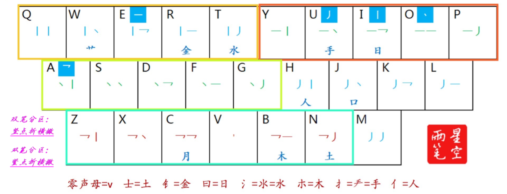

## 本方案与其他方案的差别及特点  
1. 拆字方式与原版星空二笔相同，修改了部分错码及争议编码  
2. 本方案为纯单字方案，兼有部分口水词（尚未实装）  
3. 字频偏向网络与聊天  
4. 优先考虑在四码内放入更多的常用字  
5. 一简二简字二重，部分手感极差的组合未设置二重字，极少数字下三简二重  
6. 出简不出全  
7. 次选字为编码加“2”以与首选字区分  
8.  有且仅有三个无理字，详见下方“无理字”条目  
## 无理字  

| 字 | 编码 |
|---|---|
| 大 | da |
|小|xn|
|吧|ba|  
# 规则  
## 键位图  

  
## 一简字  
|||||||||||
|--|--|--|--|--|--|--|--|--|--|
|Q去/情|W我/玩|E|R人/认|T他/它|Y一/由|U[重复上屏]|I[部首]|O|P平|  
|A|S是/上|D的/大|F发/法|G个/给|H和/很|J就/今|K可/开|L了|；[次选]|  
|Z在/主|X下/兄|C出/常|V而/啊|B不/吧|N你/呢|M没/吗|,|.|/|  
## 取码规则  
0. 取字根/字块、双笔或连续的两个单笔时，如果与笔顺相冲突，则起笔在前的部件优先取完  
1. 包围结构中，末块末笔为被包围部分的末笔而非书写顺序的末笔，例：丁弋匚囗  
2. 独体字，前两码取“声母首字母+首字根”或“声母首字母+第1、2笔”，然后连打4下单字的末笔编码，即：字根+末末末末/首笔+第二笔+末末末末。  
例如：  
士sneee（简码sne）  
木mbooo（简码mbo）  
束syooo（简码syoo）  
重cleee/zleee（简码cle/zle）  
更gyooo（简码gyo）  
三soeee（简码so）  
十syiii（简码syi）  
3. 合体字（后半为独体），前两码取“声母首字母+首字根”或“声母首字母+第1、2笔”，再取单字后半的1、2、末笔，不足6码重复打末笔编码直到补足6码。例如：  
昌ciiaee（简码cii）  
林lbeioo（简码lb）  
分fjauuu（简码fj）  
4. 合体字（后半为合体），前两码取“声母首字母+首字根”或“声母首字母+第1、2笔”，再将后半二分，后半的两部分各取头2笔。例如：  
喝hjiaua（简码hjia）  
品pjiaia（简码pj）  
鳞lkouua（简码lkou）  
   1. 如果后半的前半只有1笔，则后半可取3笔。例如：  
骊lceiao（简码lceia）  
    2. 如果后半的后半只1笔，则重复末码。例：  
担（手「u」+丨「i」+乛「a」+一「e」+一「e」）【duiaee】（简码duia）  

## 注意事项  
1. 若“丨”、“一”、“冖”，将字一分为二，则取码时跳过
“丨”、“一”、“冖”。例：  
修 xhuauu(xhu)  
壳 knuaaa(knua)  
2. 若合体字的前半只有一笔，则第二码取该单笔。例：  丽 leiaia(lei)  

